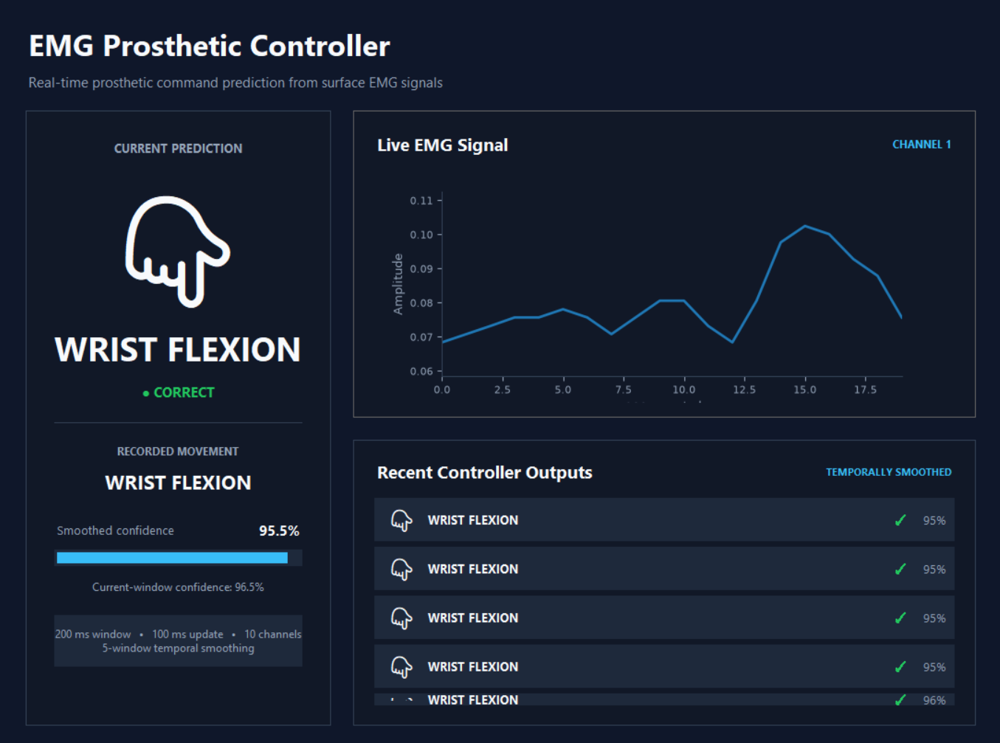
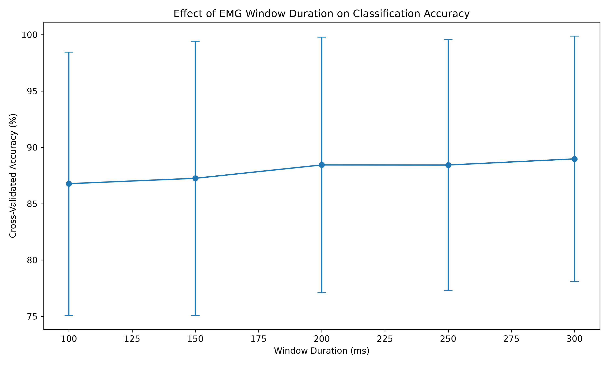
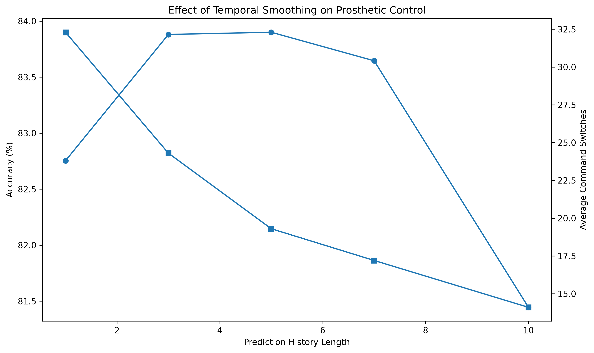

# EMG Prosthetic Hand Controller

A machine learning-based prosthetic control prototype that predicts intended hand and wrist movements from surface electromyography (sEMG) signals.

The system processes 10-channel EMG recordings, extracts time-domain signal features, classifies intended movements using a Random Forest model, and applies temporal smoothing to reduce unstable command switching.

## Demo



## Demo Commands

The controller recognizes six commands:

- Rest
- Fist
- Point
- Open hand
- Wrist flexion
- Wrist extension

## System Pipeline

EMG Signal  
↓  
200 ms Sliding Window  
↓  
Feature Extraction  
↓  
Random Forest Classifier  
↓  
Temporal Probability Smoothing  
↓  
Prosthetic Command Output

The extracted features are:

- Mean Absolute Value (MAV)
- Root Mean Square (RMS)
- Waveform Length (WL)

## Dataset

This project uses the NinaPro DB1 surface EMG dataset.

The current prototype uses recordings from Subject 1, Exercise 2, which contains hand configurations and wrist movements recorded using 10 EMG channels.

Raw dataset files are not included in this repository.

## Model Development

Several classifiers were evaluated using leave-one-repetition-out cross-validation.

| Model | Mean Accuracy | Standard Deviation |
|---|---:|---:|
| LDA | 77.61% | 6.78% |
| Logistic Regression | 85.67% | 6.75% |
| SVM | 82.82% | 6.88% |
| Random Forest | **87.86%** | **5.49%** |

Random Forest provided the strongest overall performance and the lowest variability across repetitions.

### Window Size Experiment



## Temporal Control

Independent predictions from consecutive EMG windows can cause rapid command switching.

To improve stability, the controller uses a weighted probability history in which recent predictions influence the current output.

Different history lengths were evaluated using chronological held-out EMG sequences.

| History Length | Accuracy | Average Command Switches |
|---:|---:|---:|
| 1 | 82.75% | 32.3 |
| 3 | 83.88% | 24.3 |
| 5 | **83.90%** | **19.3** |
| 7 | 83.65% | 17.2 |
| 10 | 81.44% | 14.1 |

A five-window history was selected as the best balance between classification accuracy and output stability.

Compared with the unsmoothed controller, it reduced average command switching by approximately 40%.

### Temporal Smoothing Experiment



## Project Structure

```text
emg-prosthetic-controller/
├── data/
│   ├── raw/
│   └── processed/
├── models/
├── notebooks/
│   ├── 01_explore_emg.ipynb
│   ├── 02_prosthetic_commands.ipynb
│   └── 03_temporal_smoothing.ipynb
├── results/
├── src/
│   ├── features.py
│   ├── simulator.py
│   └── visual_simulator.py
├── README.md
└── requirements.txt